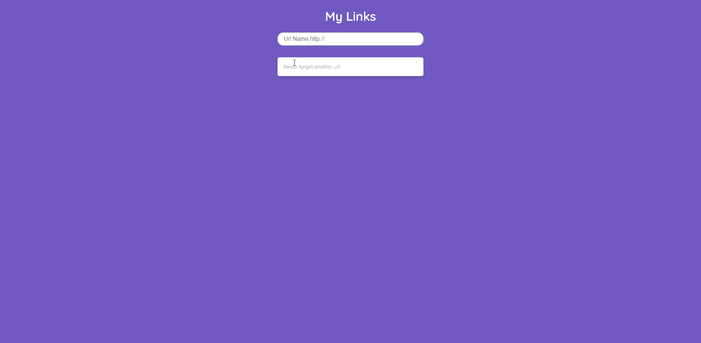

<h1 align="center">
     
    My Links
</h1>

<h4 align="center">
    Projeto desenvolvido em conjunto com a vídeo aula no canal da Rocketseat no YouTube. No projeto construímos uma API que irá fornecer dados de URL's e também as que iremos mandar para o servidor. O ponto principal para ter construído a aplicação foi para obter conhecimentos sólidos de como o Node.js funciona, como é seu ambiente de execução, seus principais módulos, a diferença entre ambiente de máquina e ambiente de browser.
</h4>
 

    

 

### 🚀 Tecnologias

 Projeto desenvolvido com as seguintes tecnologias: 

- [Node.js](https://nodejs.org/en/)
- JavaScript
- Html 5
- Css 3

 

### 🔖 Como utilizar:

 Antes de iniciarmos, é imprescindível que já tenha o Node.js instalado em sua máquina 

#### 1° Passo

 Clone o repositório: 

<code>git clone https://github.com/tamirysnogueira/MasterClass-11_Node.js </code>

 

#### 2° Passo

Entre na pasta http e após isso crie 2 terminais, um para o servidor e o outro para a API.
    No primeiro terminal irá digitar o seguinte comando: 
    <code>npm start</code>
     
    No segundo terminal irá digitar: 
    <code>npm run api</code>

#### Pronto! Sua aplicação já estará funcionando 🤩

 

### 🚧 Desafios:
✔️ Fazer a exclusão e inclusão das urls na API  

 

Feito com 💖 por TamirysNogueira. [Get in Touch!](https://www.linkedin.com/in/tamirys-nogueira-346958205/)